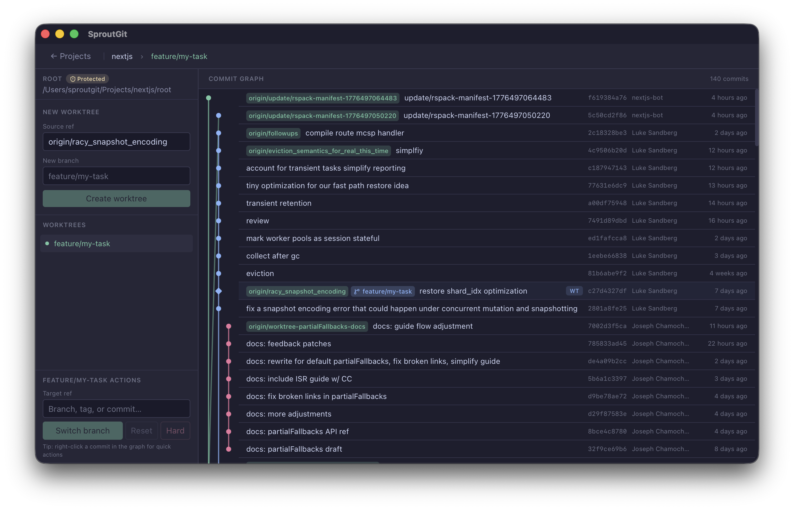

<p align="center">
  
</p>

<h1 align="center">SproutGit</h1>

<p align="center">
  A fast, open-source, cross-platform Git desktop app with a <strong>worktree-first</strong> workflow.<br/>
  Optimized for AI-driven software development.<br/>
  Built with <a href="https://v2.tauri.app">Tauri v2</a> + <a href="https://svelte.dev">SvelteKit</a> + <a href="https://www.typescriptlang.org">TypeScript</a> + <a href="https://www.rust-lang.org">Rust</a>.
</p>

<p align="center">
  <a href="#features">Features</a> •
  <a href="#workflow-policy">Workflow Policy</a> •
  <a href="#screenshots">Screenshots</a> •
  <a href="#installation">Installation</a> •
  <a href="#development">Development</a> •
  <a href="#contributing">Contributing</a> •
  <a href="#license">License</a>
</p>

<p align="center">
  <a href="https://github.com/InterestingSoftware/SproutGit/actions/workflows/ci.yml">
    
  </a>
  <a href="https://codecov.io/gh/InterestingSoftware/SproutGit">
    
  </a>
  <a href="https://github.com/InterestingSoftware/SproutGit/blob/main/LICENSE">
    
  </a>
  
  
</p>

---

> [!NOTE]
> **This is an AI-driven development project.** Much of the implementation is written by LLMs under our direction.
> We still plan architecture and execution manually, review outputs carefully, and prioritize security and strong testing standards.
> We are experienced software engineers and treat AI as a tool, not a substitute for engineering judgment.
> If you do not want to use or contribute to AI-driven development projects, this repository is probably not for you.

> [!WARNING]
> **SproutGit is an early prototype.** It is under active development and not ready for regular use. Expect missing features, rough edges, and breaking changes. Contributions and feedback are welcome!

## Why worktree-first?

Most Git GUIs treat branches as the primary unit of work. SproutGit treats **worktrees** as first-class citizens instead.

A Git worktree is a separate working directory linked to the same repository. Unlike branches, which are just pointers, worktrees give you a real, independent directory for each piece of work — no stashing, no context-switching, no losing your place.

**This matters even more with AI agents.** Modern development increasingly involves multiple AI coding agents working in parallel — reviewing code in one context, building a feature in another, fixing a bug in a third. Traditional branch workflows break down here because agents would fight over the same working directory. With worktrees, each agent gets its own isolated directory while sharing the same repo:

```
my-project/
├── root/                    # Main checkout (protected)
├── worktrees/
│   ├── feature-auth/        # Agent A is building auth
│   ├── bugfix-nav/          # Agent B is fixing navigation
│   └── refactor-api/        # Agent C is refactoring the API
└── .sproutgit/
```

No conflicts, no stash juggling, no waiting. Each agent works independently on its own worktree, and you merge when ready. SproutGit manages this layout so you don't have to think about the underlying `git worktree` commands.

## Features

- **Worktree-first workflow** — Create, switch, and manage Git worktrees in a clean prescribed directory layout
- **Interactive commit graph** — Lane-based SVG graph with search, selection, and context menus
- **Diff viewer** — Single-commit and multi-commit range diffs with file list and unified diff display
- **Branch management** — Checkout, reset (soft/mixed/hard), and create branches from any ref
- **Workspace hooks** — Run before/after create, remove, and switch operations with dependency ordering and per-hook output
- **Editor integration** — Open worktrees in your configured editor (respects `GIT_EDITOR`, `core.editor`, `VISUAL`, `EDITOR`)
- **Dark mode** — Automatic light/dark theme via system preferences
- **Cross-platform** — macOS, Windows, and Linux via Tauri v2
- **Lightweight** — Small bundle, native performance, minimal resource usage

## Workflow Policy

- Branch/worktree binding and lifecycle rules: [docs/branch-worktree-policy.md](docs/branch-worktree-policy.md)
- Workspace hook model and trigger behavior: [docs/worktree-hooks.md](docs/worktree-hooks.md)

## Workspace Hooks

SproutGit supports workspace-scoped lifecycle hooks stored in `.sproutgit/state.db`.

Supported triggers:

- `before_worktree_create`
- `after_worktree_create`
- `before_worktree_remove`
- `after_worktree_remove`
- `before_worktree_switch`
- `after_worktree_switch`
- `manual`

Hook capabilities:

- **Scope classification**: mark hooks as `worktree` or `workspace` scoped depending on whether they primarily manage one worktree or shared workspace resources
- **Cross-platform shell support**: `zsh` on macOS, `bash` on Linux, `pwsh` on Windows
- **Dependency graph**: hooks can depend on other hooks by ID
- **Parallel execution**: hooks run concurrently by default when dependencies are satisfied
- **Critical vs non-critical behavior**: critical failures can block downstream/operation flow
- **Timeouts and run logs**: stdout/stderr snippets, status, and error messages are recorded for each run
- **Live operation tracking UI**: while an operation is locked, the modal shows per-hook pending/running/complete/error status and logs
- **Manual execution**: enabled hooks can be run on demand from each worktree row via the Run hook action

### Environment variables available to hooks

SproutGit injects runtime context for each hook process:

- `SPROUTGIT_WORKSPACE_PATH`
- `SPROUTGIT_WORKSPACE_NAME`
- `SPROUTGIT_ROOT_PATH`
- `SPROUTGIT_WORKTREES_PATH`
- `SPROUTGIT_WORKTREE_PATH`
- `SPROUTGIT_WORKTREE_NAME`
- `SPROUTGIT_WORKTREE_BRANCH`
- `SPROUTGIT_WORKTREE_HEAD`
- `SPROUTGIT_WORKTREE_HEAD_SHORT`
- `SPROUTGIT_WORKTREE_DETACHED`
- `SPROUTGIT_TRIGGER`
- `SPROUTGIT_TRIGGER_PHASE`
- `SPROUTGIT_TRIGGER_ACTION`
- `SPROUTGIT_HOOK_ID`
- `SPROUTGIT_HOOK_NAME`
- `SPROUTGIT_HOOK_SCOPE`
- `SPROUTGIT_HOOK_SHELL`
- `SPROUTGIT_HOOK_CRITICAL`
- `SPROUTGIT_HOOK_TIMEOUT_SECONDS`
- `SPROUTGIT_OS`

## Is This Native Git?

Not in this form. Git has native **hook scripts** (for example `pre-commit`, `post-checkout`, `post-merge`) and native **worktree** commands, but it does not provide:

- a workspace-level hook registry in SQLite
- dependency orchestration
- critical/non-critical policy controls per hook
- a GUI for lifecycle hooks tied to managed worktree operations
- live per-hook progress/status/log rendering in a desktop app

SproutGit builds this orchestration layer on top of native Git primitives so worktree automation is predictable, cross-platform, and visible to users.

## Screenshots

<p align="center">
  
</p>

## Installation

### Download

Pre-built binaries will be available on the [Releases](../../releases) page once CI is set up.

### Build from source

#### Prerequisites

- [Node.js](https://nodejs.org/) 18+ (recommend [nvm](https://github.com/nvm-sh/nvm))
- [pnpm](https://pnpm.io/) 9+
- [Rust](https://rustup.rs/) stable toolchain
- [Git](https://git-scm.com/) 2.20+
- Platform dependencies for [Tauri v2](https://v2.tauri.app/start/prerequisites/)

#### Steps

```bash
git clone https://github.com/YOUR_USERNAME/sproutgit.git
cd sproutgit
pnpm install
pnpm tauri build
```

The built app will be in `src-tauri/target/release/bundle/`.

## Development

```bash
# Install dependencies
pnpm install

# Run in development mode (hot-reload)
pnpm tauri dev

# Frontend type checking
pnpm run check

# Frontend production build
pnpm run build

# Rust type checking
cd src-tauri && cargo check
```

## Testing & Coverage

```bash
# Run all backend unit tests
pnpm run test:security

# Run tests with verbose output
cd src-tauri && cargo test --all-targets -- --nocapture

# Generate code coverage report (requires cargo-tarpaulin)
cargo install cargo-tarpaulin
cd src-tauri && cargo tarpaulin --out Html --output-dir coverage

# View coverage report
open coverage/tarpaulin-report.html
```

All git and system interactions are security-hardened and tested. See [docs/security-audit.md](docs/security-audit.md) for details.

## Project Structure

```
sproutgit/
├── src/                          # SvelteKit frontend
│   ├── app.css                   # Design tokens (--sg-* CSS vars), animations, themes
│   ├── lib/
│   │   ├── sproutgit.ts          # Typed API layer wrapping Tauri invoke() calls
│   │   ├── toast.svelte.ts       # Toast notification state (Svelte 5 runes)
│   │   ├── validation.ts         # Branch name / ref validation
│   │   └── components/           # Reusable UI components
│   └── routes/
│       ├── +page.svelte          # Project picker (clone, open, recent)
│       └── workspace/
│           └── +page.svelte      # Main workspace (worktrees + graph + diff)
├── src-tauri/
│   ├── src/lib.rs                # Rust backend: Tauri commands, Git ops, DB
│   ├── tauri.conf.json           # App configuration
│   └── Cargo.toml                # Rust dependencies
├── docs/                         # Design docs and requirements
├── logos/                         # App icons (Apple Liquid Glass)
└── tests/                        # Tauri driver smoke tests
```

## Workspace Layout

SproutGit manages repos in a prescribed directory structure:

```
<workspace>/
├── root/                  # Main checkout (protected)
├── worktrees/             # Managed worktrees
│   ├── feature-foo/
│   └── bugfix-bar/
└── .sproutgit/
    ├── project.json
    └── state.db           # Local state (SQLite)
```

## Tech Stack

| Layer         | Technology                         |
| ------------- | ---------------------------------- |
| Desktop shell | Tauri v2 (Rust)                    |
| Frontend      | SvelteKit + Svelte 5               |
| Language      | TypeScript + Rust                  |
| Styling       | Tailwind CSS v4                    |
| Icons         | Lucide                             |
| State         | Svelte 5 runes + SQLite (rusqlite) |
| Git           | CLI via `std::process::Command`    |

## Backend Architecture & Platform

The Rust backend uses a **registered action pattern** for all git and system operations, designed for security, auditability, and testability.

**Key design principles:**

- ✅ **Secure-by-default**: Input validation, no shell interpolation, injection-safe
- ✅ **Auditable**: Every git operation is explicitly registered and testable
- ✅ **Cross-platform**: macOS, Linux, Windows with environment-aware setup
- ⚠️ **Composability gap**: Currently single-step operations; multi-step workflows require client orchestration

**For developers building on this platform:**

- Read [docs/architecture.md](docs/architecture.md) for detailed design assessment, reusability analysis, and recommendations for adding transaction/composition support
- Read [docs/branch-worktree-policy.md](docs/branch-worktree-policy.md) for branch/worktree lifecycle defaults and cleanup safety rules
- All git/system interactions route through registered helpers in `src-tauri/src/git/helpers.rs`
- Security-focused unit tests run in CI across all platforms (see `pnpm run test:security`)

## Contributing

See [CONTRIBUTING.md](CONTRIBUTING.md) for development guidelines, coding conventions, and how to submit changes.

## License

[MIT](LICENSE)
